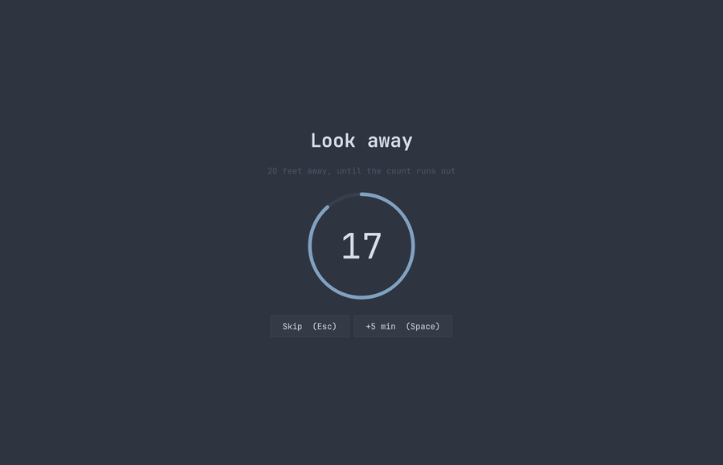
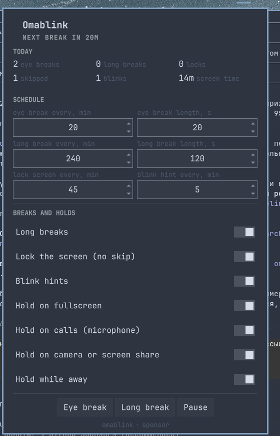
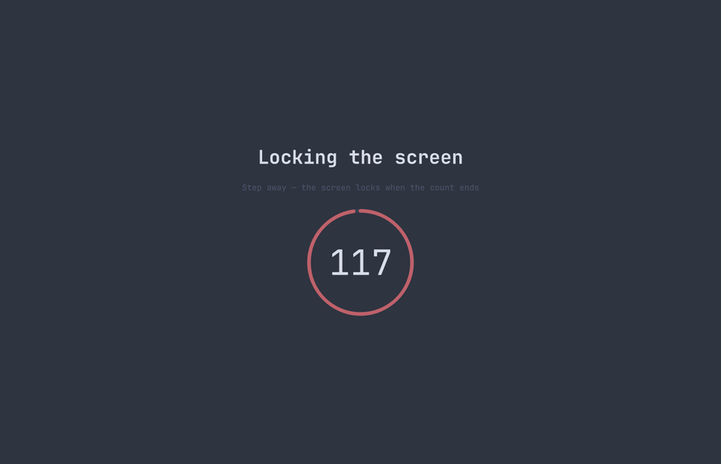

# Omablink

Screen-break timer for [Omarchy](https://omarchy.org) 4 (Quattro). Four
independent clocks, a fullscreen break overlay, a blink hint that never steals
focus, and today's numbers in the widget's own panel.



## What it does

| Tier | Default | What happens |
|---|---|---|
| Eye break | every 20 min, 20 s | Fullscreen countdown. Skippable |
| Long break | every 4 h, 2 min | Fullscreen countdown, "stand up". Skippable |
| Screen lock | every 45 min, 30 s warning | Countdown, then Omarchy's lock screen. **Not** skippable |
| Blink hint | every 5 min, ~2 s | Small strip under the bar. Takes no focus, no clicks |

Each tier counts its own elapsed seconds, so skipping or deferring one does
not shift the others. A longer rest satisfies the shorter ones: a long break
resets the eye timer, a lock resets everything.


## Install

```bash
omarchy plugin add https://github.com/vyacheslav-voloshyn/omablink.git --enable
```

`enable` appends the widget to the end of the bar's center section; move it
with `omarchy bar move amsi.omablink --section right`, or reorder the entry in
`~/.config/omarchy/shell.json`.

## Controls

| Action | How |
|---|---|
| Panel — stats and every setting | Left-click the widget |
| Eye break now | Right-click the widget |
| Pause / resume | Middle-click the widget |
| Skip a running break | `Esc`, or the Skip button (not on a lock break) |
| Postpone a running break | `Space`, or the +5 min button |

Keybindings are yours to add — in `~/.config/hypr/bindings.lua`:

```lua
o.bind("SUPER + SHIFT + L", "Omablink pause", "omarchy-shell amsi.omablink toggle")
o.bind("SUPER + SHIFT + CTRL + L", "Omablink break now", "omarchy-shell amsi.omablink breakNow")
```

IPC:

```
omarchy-shell amsi.omablink status | stats | panel
omarchy-shell amsi.omablink pause | resume | toggle
omarchy-shell amsi.omablink breakNow | longNow | lockNow | skip | blink
omarchy-shell amsi.omablink set <key> <value>
```

`set` writes into `shell.json` exactly as the panel does, so a keybinding or a
hook can change the schedule: `set lockEnabled false`, `set workMinutes 25`.

## Settings

The panel is the settings window. Omarchy 4.0.3 stores a bar widget's
`settingsForm` in plugin metadata but never renders it (`shell.qml:1407` is the
only reader), so there is no host dialog to plug into.



Everything it writes lands in the widget's entry in
`~/.config/omarchy/shell.json`:

| Key | Default | Meaning |
|---|---|---|
| `workMinutes` | 20 | Eye break interval |
| `breakSeconds` | 20 | Eye break length |
| `longMinutes` / `longSeconds` | 240 / 120 | Long break interval and length |
| `longEnabled` | true | Long breaks on |
| `lockMinutes` | 45 | Screen lock interval |
| `lockCountdownSeconds` | 30 | Warning countdown before the lock |
| `lockEnabled` | true | Screen lock on |
| `blinkMinutes` / `blinkHintSeconds` | 5 / 2 | Blink hint interval and how long it shows |
| `blinkEnabled` | true | Blink hints on |
| `headsUpSeconds` | 60 | Notification this long before a break (0 = off) |
| `postponeMinutes` | 5 | What `Space` adds |
| `idleMinutes` | 3 | Absence after which the timers hold |
| `pauseOnFullscreen` | true | Hold while a window is fullscreen |
| `pauseOnMicrophone` | true | Hold while an app captures the microphone |
| `pauseOnVideo` | true | Hold while a camera or screen share is live |
| `pauseOnIdle` | true | Hold while away |

## Holds

A break that comes due at a bad moment is deferred a minute at a time, not
dropped, so a two-hour call does not cost the whole afternoon's breaks. The
widget's tooltip says what it is waiting for.

`bin/omablink-pause-check` prints one reason per line and is called once per
due break rather than polled (~40 ms):

- **Microphone, not window titles.** Google Meet and Slack huddles live in
  browser tabs with no window of their own; the capture stream is the only
  signal that catches them.
- **A PipeWire video node** covers both the camera and a screen share through
  xdg-desktop-portal, which are the same answer: do not cover the screen.
- **Fullscreen** comes from `hyprctl activewindow -j`.
- **Idle** comes from Quickshell's `IdleMonitor` with `respectInhibitors:
  false` — a video player's inhibitor should keep the screen awake, not hold
  the eye timer. Coming back from an absence longer than one break counts as
  the break itself.

The lock break calls Omarchy's own lock service (`omarchy-shell lock lock`),
which needs PAM configured for the password prompt; `omarchy-shell lock status`
reports `passwordPam`.



## Statistics

`~/.local/state/omarchy/omablink.json` keeps one row per day (last 30): breaks
taken per tier, locks, skipped, postponed, deferred, blink hints, and screen
time — seconds where the timer was actually counting, so paused and away time
is excluded. Today's row shows in the panel; `stats` over IPC returns it as
JSON.

## Development

```bash
node test/model-test.cjs   # timer and statistics math, Qt-free on purpose
```

Settings in `shell.json` are picked up live. Editing the QML is not: a reload
can leave the previous instance running, so the bar keeps counting on the old
code. Run `omarchy restart shell` after code changes.

## Support

If this saves your eyes, [sponsor the project](https://github.com/sponsors/vyacheslav-voloshyn).

## License

MIT
